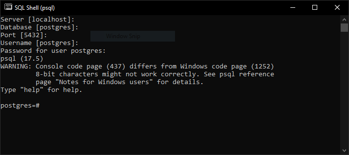

# simplilearn-PostgreSQL-Become-an-SQL-developer

from: https://www.simplilearn.com/free-postgresql-course-skillup?tag=postgresql

## sql commands
1. 
1. show version `select version();`
1. show all databases (sql shell): `\l`
1. create db: `create database sql_demo;`
1. connect to db: `\c sql_demo;`
1. create table `CREATE TABLE movies(movie_id int, movie_name varchar(40), movie_genre varchar(30), imdb_ratings real);`
1. delete table `DROP TABLE movies;`
1. show all: `SELECT * FROM movies;`
1. insert data: 
    ```
    INSERT INTO 
        movies (movie_id, movie_name, movie_genre, imdb_ratings)
    VALUES
        (101, 'Vertigo', 'Mystery, Romance', 8.3),
        (102, 'The Shawshank Redemption', 'Crime Fiction', 9.3),
        (103, '12 Angry Men', 'Drama', 9.0),
        (104, 'The Dark Knight', 'Action', 9.0),
        (105, 'The Matrix', 'Sci-Fi', 8.7),
        (106, 'Se7en', 'Crime', 8.6),
        (107, 'Interstellar', 'Adventure', 8.6),
        (108, 'The Lion King', 'Animation, Adventure', 8.5);
    ```
1. remove rows `DELETE FROM movies WHERE movie_id = 1;`
1. describe table (sql shell): `\d movies`
1. update rows
    ```
    UPDATE MOVIES
    SET
        MOVIE_GENRE = 'Drama, Crime'
    WHERE
        MOVIE_ID = 103;
    ```
1. find movies rating > 8.7
    ```
    SELECT * FROM movies
    WHERE
	    IMDB_RATINGS > 8.7;
    ```
1. find movies rating between 5 and 8.7
    ```
    SELECT * FROM movies
    WHERE
        IMDB_RATINGS > 5 AND IMDB_RATINGS < 8.7;
    ```
    or
    ```
    SELECT * FROM movies
    WHERE
        IMDB_RATINGS BETWEEN 5 AND 8.7;
    ```
1. find Action movies
    ```
    SELECT * FROM movies
    WHERE
        movie_genre LIKE '%Action%';
    ```
1. display only movie genre:
    ```
    SELECT movie_genre FROM movies;
    ```
1. find movies with rating 8.6, 8.5, 9. 
    ```
    SELECT * FROM movies
    WHERE 
        imdb_ratings BETWEEN 8.59 AND 8.61 OR imdb_ratings = 8.5 OR imdb_ratings = 9;
    ```
    or
    ```
    SELECT * FROM movies
    WHERE 
        imdb_ratings IN (8.6, 8.5, 9);
    ```
1. create table employees
    ```
    CREATE TABLE employees
    (
        EMP_ID INT NOT NULL PRIMARY KEY,
        EMP_NAME VARCHAR(40),
        EMAIL VARCHAR(40),
        GENDER VARCHAR(10),
        DEPARTMENT VARCHAR(40),
        ADDRESS VARCHAR(40),
        SALARY REAL
    );
    ```
1. Import csv employees_import.csv file into employees db.
    1. csv file in next format
        ```
        EMP_ID,EMP_NAME,EMAIL,GENDER,DEPARTMENT,ADDRESS,SALARY
        1,Briant Grantham,bgrantham@,Male,Business Development,Russia,86598.38
        2,Shurlocke Silcocks,ssilcocks1@,Male,Research and Development,Russia,73186.45
        3,Sibley Collingdon,scollingdc@,Male,Research and Development,Russia,56875.26
        4,Ninnette MacGaughey,nmacgaug@,Female,Marketing,France,68338.48
        5,Sophie Hamshere,shamshere@,Female,Services,Russia,89436.64
        ...
        ```
    1. in postgre manager click on table emloyees and select import/export -> select file and check 'Header'
    1. Or execute query:
        ```
        COPY employees(emp_id, emp_name, email, gender, department, address, salary)
        FROM 'C:\Temp\employees_import.csv'
        WITH (FORMAT csv, HEADER, DELIMITER ',');
        ```
1. 